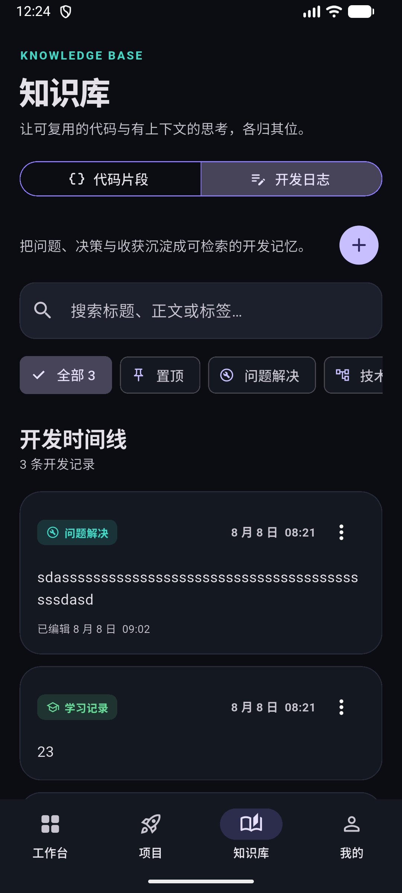
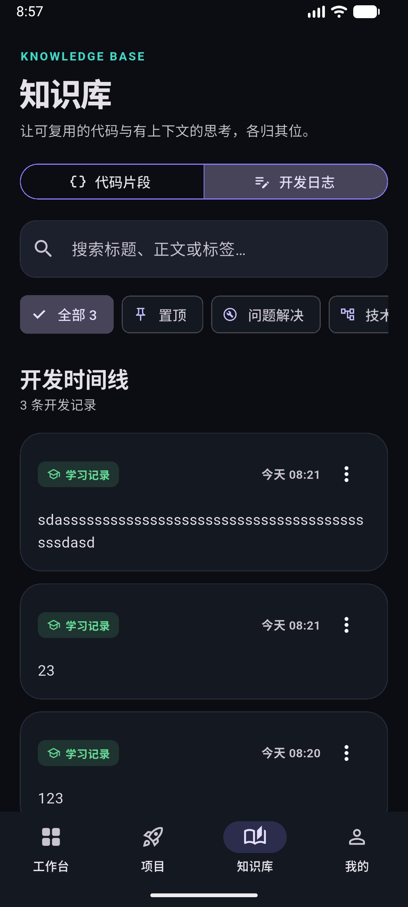
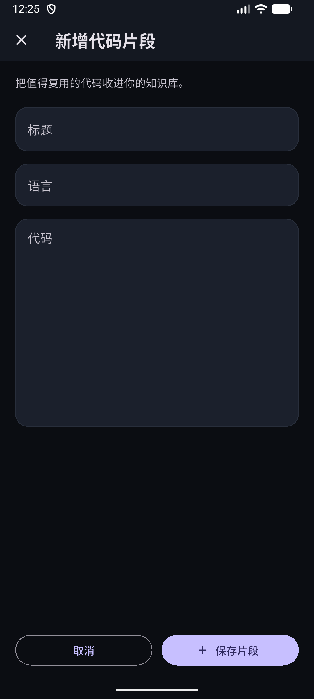
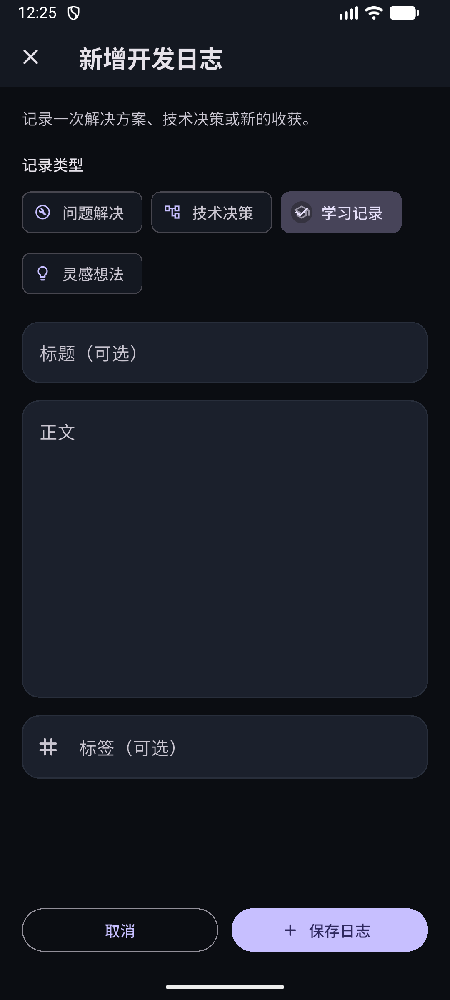

# DevNest

> 一款为程序员打造的私人工作台：追踪个人项目、管理今日目标、沉淀技术知识，并记录每天的开发过程。

**springda edition** · DevNest 是 springda 使用 Flutter 和 Material 3 构建的个人跨平台项目。它不只是一个 UI Demo，而是一个具备状态管理、本地持久化、响应式布局和组件测试的完整小型应用。

<p align="center">
  
  
  
</p>

<p align="center">
  
  
</p>

<p align="center">
  
  
</p>


## flutter 安装
当然可以。我会按“讲一点、写一点、运行验证”的方式带你学，不会一上来堆很多概念。

目前检查到：

- Flutter SDK：`E:\ProgramFiles\flutter\SDK\flutter`
- Flutter：`3.44.9 stable`
- Dart：`3.12.2`
- Android SDK：`E:\ProgramFiles\Android\Sdk`
- 当前问题：终端还找不到 `flutter` 命令，因为 Flutter 的 `bin` 目录没有加入 `PATH`

### 1. 配置 Windows 环境变量

打开：

“开始菜单” → 搜索“环境变量” → “编辑系统环境变量” → “环境变量”

在“用户变量”的 `Path` 中新增：

```text
E:\ProgramFiles\flutter\SDK\flutter\bin
```

建议同时新增：

```text
E:\ProgramFiles\Android\Sdk\platform-tools
```

然后完全关闭并重新打开 VS Code。

### 2. 验证环境

在 VS Code 新终端中运行：

```powershell
flutter --version
flutter config --android-sdk "E:\ProgramFiles\Android\Sdk"
flutter doctor -v
```

如果提示 Android licenses 未接受，再运行：

```powershell
flutter doctor --android-licenses
```

逐项输入 `y` 接受协议。

### 3. 创建第一个 Flutter 项目

你现在的 `first_demo` 文件夹是空的，所以在终端运行：

```powershell
cd E:\WorkProject\flutter\first_demo
flutter create .
```

创建完成后，先看看设备：

```powershell
flutter devices
```

如果没有设备：

- 打开 Android Studio
- 进入 Device Manager
- 创建并启动一个安卓模拟器

最后运行：

```powershell
flutter run
```

也可以在 VS Code 中打开 `lib/main.dart`，按 `F5` 启动。

你暂时只需要认识三个位置：

- `lib/main.dart`：主要编写 Dart/Flutter 代码的地方
- `pubspec.yaml`：管理依赖、图片、字体
- `android/`：Android 原生工程配置

先完成上面的步骤，把 `flutter doctor -v` 或遇到的报错发给我。环境确认后，我们进入第二课：亲手修改 `main.dart`，学习 `Widget`、`MaterialApp`、`Scaffold` 和热重载。


## Android studio 安装 Command-line Tools

这不是严重错误。Flutter 环境已经正常，只是 Android 开发还缺两项配置：

1. 缺少 `Android SDK Command-line Tools`
2. Android SDK 许可证尚未接受

如果暂时开发 Windows 或网页，已经可以运行；如果要开发 Android，需要完成下面操作。

### 第一步：安装 Command-line Tools

打开 Android Studio：

- 已进入主界面：点击 `Tools` → `SDK Manager`
- 如果在欢迎界面：点击 `More Actions` → `SDK Manager`

确认顶部的 Android SDK 路径是：

```text
E:\ProgramFiles\Android\Sdk
```

然后：

1. 选择 `SDK Tools` 标签页
2. 勾选 `Android SDK Command-line Tools (latest)`
3. 建议确认以下组件也已勾选：
   - `Android SDK Build-Tools`
   - `Android SDK Platform-Tools`
   - `Android Emulator`
4. 点击 `Apply`
5. 等待下载安装完成，然后点击 `Finish`

这是 Android 官方推荐的 SDK Manager 安装方式。[Android SDK Manager 官方说明](https://developer.android.com/studio/intro/update)

### 第二步：接受许可证

安装完成后，重新打开一个 VS Code 终端，执行：

```powershell
flutter doctor --android-licenses
```

出现类似：

```text
Accept? (y/N)
```

就输入：

```text
y
```

把所有协议都接受。

### 第三步：重新检查

```powershell
flutter doctor -v
```

理想结果应该变为：

```text
[√] Android toolchain - develop for Android devices
```

另外，你当前检测到的三个设备是 Windows、Chrome 和 Edge，还没有运行中的 Android 模拟器。工具链修复后，我们再创建并启动安卓模拟器。


## 启动安卓模拟器

这不是错误，说明 Flutter 已经识别到 3 个可运行平台：

- `windows`：Windows 桌面程序
- `chrome`：Chrome 网页程序
- `edge`：Edge 网页程序

目前没有 Android 设备，是因为：

- 安卓模拟器还没有创建或启动；或者
- 没有连接开启 USB 调试的安卓手机

如果你想先快速运行 Flutter，可以执行：

```powershell
flutter create .
flutter run -d chrome
```

如果想运行 Android 模拟器，先查看已有模拟器：

```powershell
flutter emulators
```

如果有模拟器，会显示一个模拟器 ID，然后运行：

```powershell
flutter emulators --launch 模拟器ID
```

启动后再次检查：

```powershell
flutter devices
```

看到类似下面的设备就成功了：

```text
emulator-5554 • android-x64 • Android ...
```

如果执行 `flutter emulators` 后没有模拟器，就需要打开 Android Studio → `Device Manager` → `Create Virtual Device`，创建一个虚拟手机。

你下一步先运行：

```powershell
flutter emulators
```

很好，你已经有一个可用的 Android 模拟器：

```text
Medium_Phone_API_36.1
```

现在启动它：

```powershell
flutter emulators --launch Medium_Phone_API_36.1
```

等待模拟器出现安卓桌面后，再执行：

```powershell
flutter devices
```

正常情况下会新增类似：

```text
emulator-5554 • android-x64 • Android 16
```

然后在当前空项目目录中创建 Flutter 项目：

```powershell
flutter create .
```

创建完成后运行：

```powershell
flutter run
```

如果 Flutter 让你选择设备，就选择 Android 模拟器。也可以明确指定：

```powershell
flutter run -d emulator-5554
```

其中 `emulator-5554` 要替换成 `flutter devices` 实际显示的设备 ID。

第一次构建 Android 项目需要下载 Gradle 依赖，可能会等待几分钟。等默认的计数器页面出现，就代表整个 Flutter Android 开发环境完全配置成功。


## 功能亮点

### 今日工作台

- 添加、完成与删除今日任务
- 实时计算任务完成率
- 汇总活跃项目与收藏代码片段
- 根据时间显示动态问候语

### Project Radar 项目雷达

- 管理规划中、开发中、暂停和已完成的个人项目
- 记录项目说明、技术栈、当前进度和下一步行动
- 支持按状态筛选项目
- 支持新增、编辑和删除项目

### Knowledge Base 知识库

代码片段和开发日志被收进同一个知识模块，但保留各自独立的数据结构与使用场景：

#### Code Vault 代码片段

- 新增、编辑和删除个人代码片段
- 通过加号进入独立全屏编辑器，避免键盘挤压列表页面
- 按标题、语言或代码内容搜索
- 筛选收藏片段并置顶展示
- 展开查看、选择和复制完整代码
- 删除前进行二次确认，避免误操作

#### Dev Log 开发日志

- 使用标题、正文、类型和标签组织开发记录
- 时间线默认保持紧凑，通过加号进入独立全屏编辑器
- 支持问题解决、技术决策、学习记录和灵感想法四种类型
- 长篇正文默认折叠，可展开全文或收起
- 按标题、正文或标签搜索，并按类型或置顶状态筛选
- 支持置顶、编辑与删除确认
- 置顶优先、其余按时间倒序展示开发轨迹
- 自动生成本地日期与时间标签
- 可从工作台直接打开日志视图

### 我的

- 使用 springda 的个人头像与英文名建立专属开发者身份
- 工作台问候语会读取本地资料，并加入 `SPRINGDA EDITION` 品牌署名
- 编辑并持久化开发者称呼、角色与签名
- 汇总项目、代码片段、开发日志和已完成任务数量
- 明确展示本地存储与隐私边界
- 查看应用版本与技术信息

### 跨平台体验

- 手机窄屏使用底部 `NavigationBar`
- 平板和桌面宽屏自动切换为 `NavigationRail`
- 支持 Android、Web 和桌面平台
- 深色 Material 3 视觉系统

## 技术栈

| 分类 | 技术 |
| --- | --- |
| UI 框架 | Flutter 3.44 / Material 3 |
| 编程语言 | Dart 3.12 |
| 状态管理 | `ChangeNotifier` + `AnimatedBuilder` |
| 数据架构 | Repository + 可替换的数据源 |
| 本地存储 | `shared_preferences` 的异步 API |
| 响应式布局 | `LayoutBuilder`、Sliver、NavigationRail |
| 测试 | `flutter_test` Widget Tests |

项目刻意保持依赖精简，以便直接观察 Flutter 自身的状态更新、组件组合和渲染机制。

## 项目结构

```text
lib/
├── main.dart                       # 应用初始化与启动入口
├── app.dart                        # MaterialApp 与自适应导航外壳
├── core/
│   └── app_controller.dart         # 页面状态与业务操作
├── data/
│   ├── repositories/
│   │   └── app_repository.dart     # 数据契约、模型映射与本地实现
│   └── services/
│       └── storage_service.dart    # SharedPreferences 原始数据源
├── models/
│   └── dev_models.dart             # Task、Project、Snippet、Log、Profile 模型
├── screens/
│   ├── dashboard_screen.dart       # 今日工作台
│   ├── projects_screen.dart        # 项目雷达与项目管理
│   ├── knowledge_screen.dart       # 知识库双视图容器
│   ├── vault_screen.dart           # 代码片段
│   ├── dev_log_screen.dart         # 开发日志
│   └── profile_screen.dart         # 我的与数据概览
├── theme/
│   └── app_theme.dart              # 颜色、文字与组件主题
└── widgets/
    └── dev_widgets.dart            # 通用展示组件
```

数据更新流程：

```text
用户操作
  → AppController 修改不可变列表
  → notifyListeners()
  → AnimatedBuilder 重建相关页面
  → AppRepository 保存领域数据
  → LocalAppRepository 完成 JSON 映射与旧数据迁移
  → SharedPreferencesStorage 写入本机
```

页面与 Controller 只依赖 `AppRepository` 契约。以后可以添加 REST API、MySQL
远程实现或 SQLite 离线实现，而不需要修改现有页面。

## 快速开始

### 环境要求

- Flutter SDK `3.44.0` 或更高版本
- Dart SDK `3.12.0` 或更高版本
- Android Studio / Android SDK（运行 Android 版本时需要）

检查开发环境：

```bash
flutter doctor -v
```

### 获取并运行项目

```bash
git clone https://github.com/spring-da/first-flutter-project.git
cd first-flutter-project
flutter pub get
flutter run
```

指定 Android 模拟器运行：

```bash
flutter devices
flutter run -d emulator-5554
```

也可以运行 Web 或 Windows 版本：

```bash
flutter run -d chrome
flutter run -d windows
```

## 质量检查

```bash
dart format lib test
flutter analyze
flutter test
flutter build apk --debug
```

当前项目包含以下组件测试：

- 工作台核心内容渲染
- 今日任务状态更新
- 从工作台导航到项目雷达
- 编辑项目并保存进度
- 取消新增片段时的生命周期回归测试
- 代码片段与开发日志全屏编辑器的取消流程和窄屏布局
- 展开、编辑和收藏状态保留
- 删除代码片段的取消与确认流程
- 知识库片段 / 日志双视图切换
- 工作台快捷入口深链至开发日志
- 结构化日志录入与标签去重
- 长篇日志折叠和展开
- 日志搜索、类型筛选、置顶、编辑及安全删除
- 旧版纯文本日志无损兼容
- 编辑并展示本地开发者资料
- 旧版本地数据的无损迁移
- 工作台、知识库和“我的”窄屏布局

目前共包含 **25 项自动化测试**。

## 本地数据与隐私

DevNest 当前没有账号系统，也不会向服务器发送项目、任务、代码片段、日志或开发者资料。所有数据通过 `shared_preferences` 保存在本机。

`shared_preferences` 不是加密存储，请不要保存密码、访问令牌、私钥等敏感信息。如果未来需要保存凭证，可接入系统 Keychain/Keystore 类型的安全存储方案。

## Roadmap

- [ ] 支持任务优先级、截止日期和归档
- [ ] 为项目增加里程碑和关联任务
- [ ] 支持 Markdown 开发日志
- [ ] 支持代码片段标签管理和语法高亮
- [ ] 增加数据导入、导出和加密备份
- [ ] 引入 Repository 层并补充单元测试

## 学习价值

这个项目适合用来理解和实践：

- Flutter Widget 树与组合式 UI
- `StatelessWidget` 与 `StatefulWidget` 的边界
- `ChangeNotifier` 驱动的轻量状态管理
- 异步初始化和本地持久化
- 手机、平板、桌面端响应式布局
- Sliver 懒加载列表和网格
- Widget Test 中的滚动、点击和页面断言

---

如果这个项目对你有帮助，可以给它一个 Star，并基于 Roadmap 继续扩展属于自己的开发者工作台。
