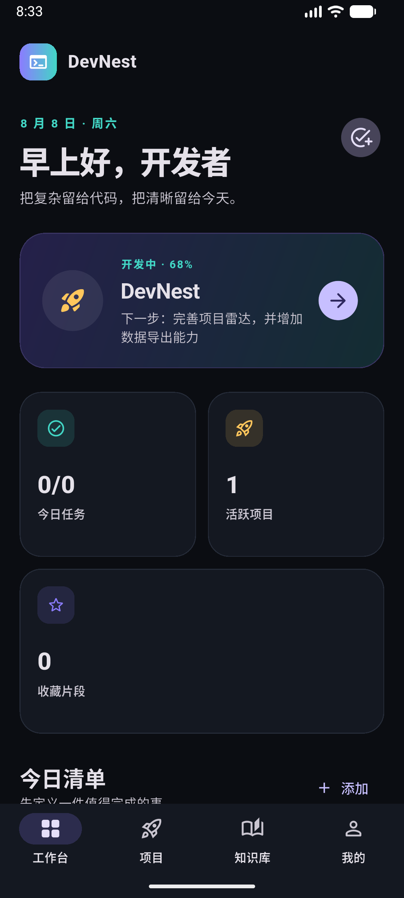
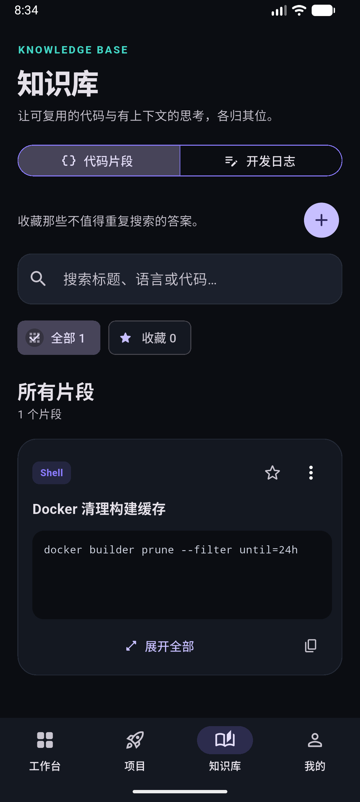
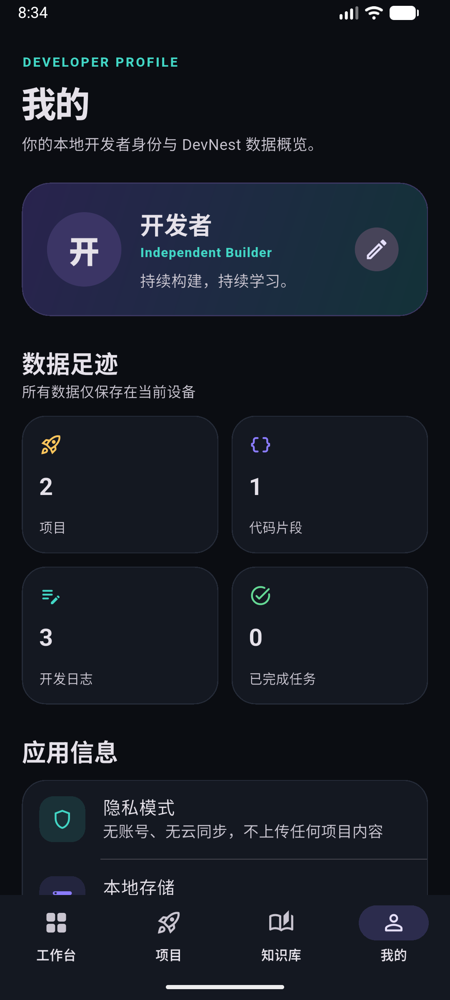

# DevNest

> 一款为程序员打造的私人工作台：追踪个人项目、管理今日目标、沉淀技术知识，并记录每天的开发过程。

DevNest 是一个使用 Flutter 和 Material 3 构建的跨平台练习项目。它不只是一个 UI Demo，而是一个具备状态管理、本地持久化、响应式布局和组件测试的完整小型应用。

<p align="center">
  
  
  
</p>

## 功能亮点

### 今日工作台

- 添加、完成与删除今日任务
- 实时计算任务完成率
- 汇总活跃项目与收藏代码片段
- 根据时间显示动态问候语

### Project Radar 项目雷达

- 管理规划中、开发中、暂停和已完成的个人项目
- 记录项目说明、技术栈、当前进度和下一步行动
- 支持按状态筛选项目
- 支持新增、编辑和删除项目

### Knowledge Base 知识库

代码片段和开发日志被收进同一个知识模块，但保留各自独立的数据结构与使用场景：

#### Code Vault 代码片段

- 新增、编辑和删除个人代码片段
- 按标题、语言或代码内容搜索
- 筛选收藏片段并置顶展示
- 展开查看、选择和复制完整代码
- 删除前进行二次确认，避免误操作

#### Dev Log 开发日志

- 快速记录解决方案、技术决策和待处理问题
- 按时间倒序展示开发轨迹
- 自动生成本地日期与时间标签
- 可从工作台直接打开日志视图

### 我的

- 编辑并持久化开发者称呼、角色与签名
- 汇总项目、代码片段、开发日志和已完成任务数量
- 明确展示本地存储与隐私边界
- 查看应用版本与技术信息

### 跨平台体验

- 手机窄屏使用底部 `NavigationBar`
- 平板和桌面宽屏自动切换为 `NavigationRail`
- 支持 Android、Web 和桌面平台
- 深色 Material 3 视觉系统

## 技术栈

| 分类 | 技术 |
| --- | --- |
| UI 框架 | Flutter 3.44 / Material 3 |
| 编程语言 | Dart 3.12 |
| 状态管理 | `ChangeNotifier` + `AnimatedBuilder` |
| 本地存储 | `shared_preferences` 的异步 API |
| 响应式布局 | `LayoutBuilder`、Sliver、NavigationRail |
| 测试 | `flutter_test` Widget Tests |

项目刻意保持依赖精简，以便直接观察 Flutter 自身的状态更新、组件组合和渲染机制。

## 项目结构

```text
lib/
├── main.dart                       # 应用初始化与启动入口
├── app.dart                        # MaterialApp 与自适应导航外壳
├── core/
│   ├── app_controller.dart         # 全局状态与业务操作
│   └── storage_service.dart        # 持久化接口及实现
├── models/
│   └── dev_models.dart             # Task、Project、Snippet、Log、Profile 模型
├── screens/
│   ├── dashboard_screen.dart       # 今日工作台
│   ├── projects_screen.dart        # 项目雷达与项目管理
│   ├── knowledge_screen.dart       # 知识库双视图容器
│   ├── vault_screen.dart           # 代码片段
│   ├── dev_log_screen.dart         # 开发日志
│   └── profile_screen.dart         # 我的与数据概览
├── theme/
│   └── app_theme.dart              # 颜色、文字与组件主题
└── widgets/
    └── dev_widgets.dart            # 通用展示组件
```

数据更新流程：

```text
用户操作
  → AppController 修改不可变列表
  → notifyListeners()
  → AnimatedBuilder 重建相关页面
  → SharedPreferencesAsync 异步保存 JSON
```

## 快速开始

### 环境要求

- Flutter SDK `3.44.0` 或更高版本
- Dart SDK `3.12.0` 或更高版本
- Android Studio / Android SDK（运行 Android 版本时需要）

检查开发环境：

```bash
flutter doctor -v
```

### 获取并运行项目

```bash
git clone https://github.com/spring-da/first-flutter-project.git
cd first-flutter-project
flutter pub get
flutter run
```

指定 Android 模拟器运行：

```bash
flutter devices
flutter run -d emulator-5554
```

也可以运行 Web 或 Windows 版本：

```bash
flutter run -d chrome
flutter run -d windows
```

## 质量检查

```bash
dart format lib test
flutter analyze
flutter test
flutter build apk --debug
```

当前项目包含以下组件测试：

- 工作台核心内容渲染
- 今日任务状态更新
- 从工作台导航到项目雷达
- 编辑项目并保存进度
- 取消新增片段时的生命周期回归测试
- 展开、编辑和收藏状态保留
- 删除代码片段的取消与确认流程
- 知识库片段 / 日志双视图切换
- 工作台快捷入口深链至开发日志
- 编辑并展示本地开发者资料
- 旧版本地数据的无损迁移
- 工作台、知识库和“我的”窄屏布局

目前共包含 **17 项自动化测试**。

## 本地数据与隐私

DevNest 当前没有账号系统，也不会向服务器发送项目、任务、代码片段、日志或开发者资料。所有数据通过 `shared_preferences` 保存在本机。

`shared_preferences` 不是加密存储，请不要保存密码、访问令牌、私钥等敏感信息。如果未来需要保存凭证，可接入系统 Keychain/Keystore 类型的安全存储方案。

## Roadmap

- [ ] 支持任务优先级、截止日期和归档
- [ ] 为项目增加里程碑和关联任务
- [ ] 支持 Markdown 开发日志
- [ ] 支持代码片段标签管理和语法高亮
- [ ] 增加数据导入、导出和加密备份
- [ ] 引入 Repository 层并补充单元测试

## 学习价值

这个项目适合用来理解和实践：

- Flutter Widget 树与组合式 UI
- `StatelessWidget` 与 `StatefulWidget` 的边界
- `ChangeNotifier` 驱动的轻量状态管理
- 异步初始化和本地持久化
- 手机、平板、桌面端响应式布局
- Sliver 懒加载列表和网格
- Widget Test 中的滚动、点击和页面断言

---

如果这个项目对你有帮助，可以给它一个 Star，并基于 Roadmap 继续扩展属于自己的开发者工作台。
